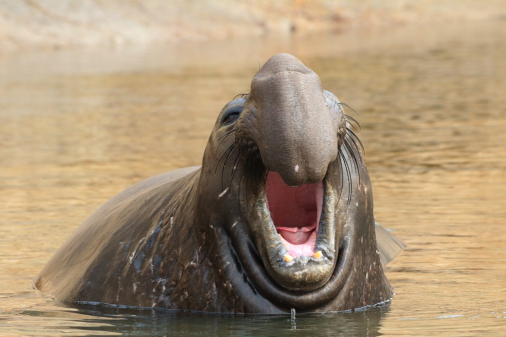

# The Wonderful World of RMarkdown

## What is Rmarkdown? What are code blocks?

Markdown is a 'markup' language - essentially, it lets us write documents that include *italics*, **bold**, [hyperlinks](https://bookdown.org/yihui/rmarkdown/markdown-syntax.html), images, HTML/CSS blocks, etc., and is very commonly used on the web (e.g. GitHub). *RMarkdown* documents allow us to write a mixture of text (headers and body text) and R code, then 'knit' the document together into some kind of easily shared file (e.g. HTML, PDF, etc.). I like to use RMarkdown documents whenever I am collaborating with colleagues, as it's much easier to share a single, interactive HTML file instead of R script files. Very few people seem to appreciate receiving R script files!

At the very top of a Markdown page, you will see some strange stuff - this is called the YAML header of the document, and is used to add things like titles, authors, dates, etc. to the doc. One important option in there is a document style; there are many packages that give you different styles, I would recommend starting with {rmdformats}. Check out the [available formats](https://bookdown.org/yihui/rmarkdown/rmdformats.html)!

Below is a code block, in which we will write R (or Python, or even HTML+CSS+javascript...) code. You will notice that you can add a name for each code block (e.g. 'setup_block'), followed by a list of arguments. Some examples:

-   *include*: should any of the output from this block (results, text, warnings, errors, etc.) be displayed?
-   *echo*: should the R (or Python) code be shown in the document? We can choose whether or not to display this code block in the final product with the 'echo' option.
-   *message*: If any functions used in a code block return messages to the R Console, these will be included in the document if this argument is TRUE.
-   *fig.width* and *fig.height*: These are useful for adjusting the size of plots / images.

```{r setup_block, include = F}

# Note: the 'include = F' above means we don't want to see ANY result of this code block.
# It still runs, but we don't care to see any warnings, results, etc.
# This is a nice way to keep the resulting document a readable length, and tidy.
library(tidyverse)
library(rayshader)
library(leaflet)
library(scales)
library(ggiraph)
library(ggpubr)

# You can set options for ALL of your code chunks using the below command. 
# This means that the default knitting behaviour is to NOT include code chunks in 
# the output document, nor to include warnings. Errors would still be included.
knitr::opts_chunk$set(echo = F, warning = F)

# This is usually a nice code block to use to load in your dataset(s)!
```

```{r, include = T, echo = T}
# Setting up some variables.
var_1 = c(1,2,3)
var_2 = c(5,5,10)

# Doing some wacky math.
my_results = var_1 * var_2

# When we call an object, or a model, or a plot, its output will be added to our markdown document.
my_results
```

Note: You can include code 'in-line' by using backticks (\`) and specifying the coding language you want to use. So if I wanted to write a block of text that included the output of some stats or analyses run in R, I could do it like this:

As of `r Sys.Date()`, the number of days left in the year is `r 365 - lubridate::yday(Sys.Date())`.

## What can I include in a Markdown doc?

### Tables (static tables with {knitr})

```{r, warning=F, echo = F}
# Drop any warnings that R may give us.
my_table = iris |> 
  as_tibble() |> 
  sample_n(10)

knitr::kable(my_table)
```

### Tables (interactive tables with {DT})

```{r, warning=F, echo = F}
# Drop any warnings that R may give us.
my_table = mtcars |> 
  as_tibble()

DT::datatable(my_table)
```

### Plots (static - {ggplot2} or base plots)

```{r example_plot, echo = F, warning=F, fig.width = 6, fig.height = 6}
ggplot(mtcars) + 
  geom_boxplot(
    aes(x = carb,
        y = mpg,
        group = carb)
  )
```

### Plots (interactive, e.g. {ggiraph}, {plotly}, {d3}, etc.)

```{r, message=F}
nr = bcmaps::nr_districts()

plot_for_girafe = ggarrange(
  ggplot() + 
    ggiraph::geom_sf_interactive(
      data = nr,
      aes(
        fill = FEATURE_AREA_SQM,
        tooltip = DISTRICT_NAME,
        data_id = DISTRICT_NAME
      )
    ) + 
    theme(legend.position = 'none'),
  ggplot(data = nr) + 
    geom_col_interactive(
      aes(
        x = reorder(DISTRICT_NAME,-FEATURE_AREA_SQM),
        y = FEATURE_AREA_SQM,
        tooltip = DISTRICT_NAME,
        data_id = DISTRICT_NAME
      )
    ) + 
    theme(axis.text.x = element_blank(),
          axis.title.x = element_blank())
)

girafe(ggobj = plot_for_girafe)
```

### Code (and its output)

```{r, echo = T}
# Here is some code that will be visible in the knitted document.
fake_latin = rep('lorem ipsum',10)

paste0(paste0(fake_latin, collapse = ', '),'.')
```

### Maps (static or interactive, e.g. {ggplot2}, {leaflet}, {tmap})

```{r example_leaflet_map, message=F}

nr = bcmaps::nr_regions()

# Reproject the Natural Resource Regions from BC Albers to WGS 84; Leaflet 
# only consumes WGS 84!
nr = sf::st_transform(nr, crs = 4326)

# Remove the suffix 'Natural Resource Region' from the region names.
nr = nr |> 
  dplyr::mutate(REGION_NAME = stringr::str_remove(REGION_NAME, ' Natural Resource Region'))

table_for_leaflet_map = leafpop::popupTable(
  nr |> 
    sf::st_drop_geometry() |> 
    dplyr::select(`Region name` = REGION_NAME,
                  `Area (square meters)` = FEATURE_AREA_SQM)
)

# This is a lot of code... don't worry about this if it is too intimidating!
image_for_leaflet_map = leafpop::popupGraph(
  # Use {purrr} to apply a complicated function to each element in 
  # the specified vector; in this case, the REGION_NAME column from the 'nr' object.
  purrr::map(nr$REGION_NAME, ~ {
    nr |> 
      # Drop the geometry column; if not, things get messy!
      sf::st_drop_geometry() |>
      # Overwrite the REGION_NAME column with an ordered factor (ordered by FEATURE_AREA_SQM field)
      dplyr::mutate(REGION_NAME = forcats::fct_lump(REGION_NAME, n = 5, w = FEATURE_AREA_SQM)) |>
      dplyr::arrange(dplyr::desc(FEATURE_AREA_SQM)) |> 
      dplyr::mutate(REGION_NAME = forcats::fct_inorder(REGION_NAME)) |> 
      # Summarise area by region name.
      dplyr::group_by(REGION_NAME) |> 
      dplyr::summarise(FEATURE_AREA_SQM = sum(FEATURE_AREA_SQM)) |> 
      # Add colour column based on some if/else conditions -
      # In this round of the "map" function, which row's region name matches .x?
      dplyr::mutate(colour_for_plot = ifelse(REGION_NAME == .x, 'orange', 'grey')) |>
      # Did .x not match any of the region names? This means it was in the 'Other' column.
      # Make it orange!
      dplyr::mutate(colour_for_plot = case_when(
        sum(colour_for_plot != 'grey') != 0 ~ colour_for_plot,
        sum(colour_for_plot != 'grey') == 0 & REGION_NAME == 'Other' ~ 'orange', 
        T ~ 'grey'
        )) |> 
      # Make a ggplot.
      ggplot() + 
      geom_col(
        aes(x = REGION_NAME,
            y = FEATURE_AREA_SQM,
            fill = colour_for_plot)
      ) + 
      # Specify the breaks and labels for the y axis.
      scale_y_continuous(breaks = scales::breaks_pretty(),
                         labels = scales::label_number(scale_cut = cut_long_scale())) +
      # Set the colour palette 
      # Note: (this looks redundant - does anyone know a better way to 
      #        set the colour in a ggplot using a column with colours as strings?)
      scale_fill_manual(values = c('orange' = 'orange', 'grey' = 'grey')) +
      # Adjust X and Y axis labels
      labs(x = '',
           y = 'Area (millions of square meters)') + 
      # Make X axis tick labels angled, remove legend from figure
      theme(axis.text.x = element_text(angle = 45, hjust = 1, vjust = 1),
            legend.position = 'none') 
  })
)

leaflet() |> 
  addTiles() |> 
  addPolygons(
    label = ~lapply(
      table_for_leaflet_map,
      htmltools::HTML
    ),
    popup = lapply(
      image_for_leaflet_map,
      htmltools::HTML
    ),
    color = 'darkgrey',
    weight = 2,
    opacity = 0.8,
    fillColor = 'lightblue',
    fillOpacity = 0.6,
    data = nr
  )
```

### Images

```{r elephant_seal}
# If the image is on our local machine, we can include it this way:
# 
# We can also include a URL to show an image from the internet!
```

We can include an image like this: 

Or we can include an image using {magick}.

```{r cat_picture, fig.width=5}
# We can include it with knitr::include_graphics, or with one of my favourite packages, {magick} (for image reading, manipulation, writing ,etc.)

magick::image_read('https://upload.wikimedia.org/wikipedia/commons/5/59/Seal-tortie.jpg')
```

### Tabsets {.tabset}

#### Tab A (Plotly figure)

```{r tab_a_content, echo = F}
plotly::ggplotly(
  mtcars |> 
  mutate(cyl = as.factor(cyl)) |> 
  ggplot() + 
  geom_boxplot(aes(x = cyl, y = mpg, group = cyl)) + 
  theme_minimal()
)
```

#### Tab B (Rayshader fun)

```{r tab_b_content, echo = F}
volcano |>
  sphere_shade(texture = "desert") |>
  # add_water(detect_water(volcano), color = "desert") |>
  add_shadow(ray_shade(volcano, zscale = 10), 0.5) |>
  add_shadow(ambient_shade(volcano), 0) |>
  rayshader::plot_3d(volcano, zscale = 3, fov = 0, theta = 135, zoom = 0.75, phi = 45, windowsize = c(1000, 800))
rgl::rglwidget()

# `r htmltools::HTML("<style>.hello_world{color:lightblue;font-family:fantasy;}.hello_world:hover{color:red}</style><span class = 'hello_world'>Hello World!</span>")`
```

#### HTML+CSS+JS

```{=html}
<style>
.hello_world {
  color:purple;
  font-family:fantasy;
  position: relative;
  top: 50%;
  text-align:center;
  }
.hello_world:hover {
  color:red
  }
.container_box {
  width: 200px;
  height: 200px;
  top: 25%;
  left:50%;
  position:relative;
  text-align:center;
  border-radius: 5%;
  background: #D3D3D3;
  transition: ease 1s;
  }
.container_box:hover {
  transform: rotate(180deg);
  }
</style>
```
::: {style="width: 400px;height:400px;color:white;"}
::: container_box
::: {#hw .hello_world}
Hello World!
:::

<audio id="item_noise" src="https://us-tuna-sounds-files.voicemod.net/93978887-9fe6-4c10-853d-cb8d1d49338e-1671895200854.mp3">

</audio>
:::
:::

```{=html}
<script>
my_el = document.getElementById('hw');

my_el.addEventListener('click', el => {
    
    noise = document.getElementById('item_noise')
    noise.play();
    alert('You clicked me!');
});
</script>
```
